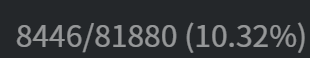
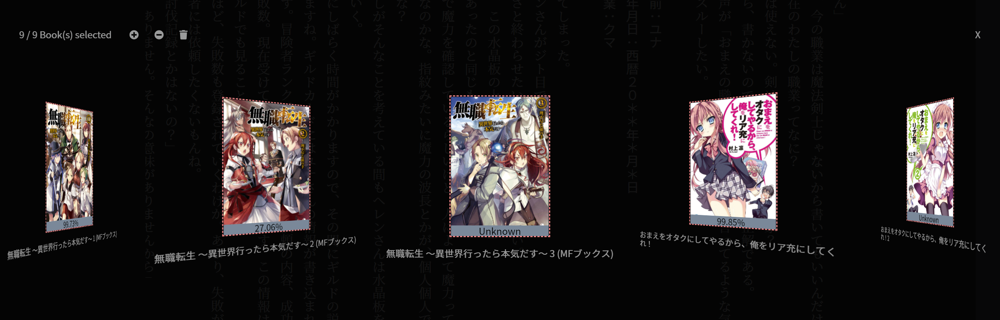

## ッツ Ebook Reader

Source code for the Website [https://ttu-ebook.web.app](https://ttu-ebook.web.app), an online e-book reader that supports Yomichan.

# Features

- [x] Supports HTMLZ and EPUB Files
- [x] Vertical Reading Style
- [x] Local Book Library to access Novels without the need of reloading them every Time
- [x] Book Manager to quickly change between Novels or simply delete them
- [x] Experience Settings (Themes, Font Size, Image Blur, Furigana Settings)
- [x] Bookmark Functionality
- [x] Current Character and Progress Display
- [x] Installable as Application on supported Platforms

# Usage:

The first Time you enter the Page (or have no Books loaded yet) you need to select the Novels you intent to read. You can load a Single File by clicking/tapping on the Dropzone or select a whole Folder (Desktop Only) with right click. Alternatively simply drag&drop Files and Folders on the Element in case you are a Desktop User. After the successful Import of Books to your Library, the last Title you have loaded will be displayed and you are free to enjoy your Reading Time. On your next Visit the Page will automatically load the last Book you have read.

You can find following Control Elements in the upper right Corner of the Page:

Element | Description
--- | ---
 | Allows you to load new Books to your Library
 | Allows you to load new Books from a Folder to your Library (Desktop Only)
 | Allows you to delete the current Book from your Library (Keybind x)
 | Opens the Book Manager (Keybind m)
 | Allows you to set a Bookmark at your current Location (Keybind b)
 | Opens the Reader Settings

In the bottom right corner you will be able to see your current Reading Progress.  

You can toggle the visibility by clicking/tapping on it.

An Update to the Page is indicated by the  Symbol in the bottom left corner. After the next Page reload it will automatically be applied in case you are connected with the Internet.

# Desktop Keybinds:

**Note:** The Keys are currencly bound to their Physical Location. 
Explanation from [MDN](https://developer.mozilla.org/en-US/docs/Web/API/KeyboardEvent/code):

> For example, the code returned is "KeyQ" for the Q key on a QWERTY layout keyboard, but the same code value also represents the ' key on Dvorak keyboards and the A key on AZERTY keyboards. 

Key Code | Description
--- | ---
<kbd>Escape</kbd> | Close Settings Dialog
<kbd>Space</kbd> | Toggle Auto-Scrolling
<kbd>A</kbd> / <kbd>D</kbd> | Increase / Decrease Auto-Scrolling Speed
<kbd>B</kbd> | Create Bookmark at current Position
<kbd>M</kbd> | Open Book Manager
<kbd>X</kbd> | Delete Current Book
<kbd>PageDown</kbd> / <kbd>PageUp</kbd> | Turn Pages

# Book Manager:

You can open the Book Manager by clicking/tapping on the respective Icon or pressing its Keybind (m) as Desktop User. You will presented with a List of Covers of all your imported Novels and their respective Title. You can easily navigate through them by swiping or using the Arrow Keys on Desktop. Clicking on a Book Title will update your current Reader Content. With double Click you can select a Novel for Deletion - highlighted by the red border. Alternatively you can also click on the + plus sign to select all Books or on the the - icon to deselect all Novels. Clicking on the Trashcan Icon will allow to delete all selected Books after your Confirmation. In Caset you set a Bookmark for the Novel it will additionally show the current Title Progress - otherwise the term "Unknown".

