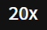
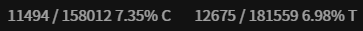

## ッツ Ebook Reader

An online e-book reader that supports dictionary extensions like Yomichan, which is hosted on [https://reader.ttsu.app](https://reader.ttsu.app)

# Features

- [x] Supports HTMLZ and EPUB files
- [x] Customizable environment (e. g. themes, font size, image blur, furigana settings etc.)
- [x] Continuous / Pagination reader mode
- [x] Vertical / Horizontal reading mode
- [x] Basic Time/Character and Reading Goals Tracker
- [x] Reading Data Statistics
- [x] Character count and progress display
- [x] Table of content support for EPUB files
- [x] (Auto) bookmark functionality
- [x] Auto scroll (continuous mode)
- [x] Book manager
- [x] Data import/export via local and external sources
- [x] Installation and offline capabilities

# Usage

The first time you enter the page (or have no files loaded yet) you will need to select the books you want to read from your device.
You can load files by clicking/tapping on the dropzone or respective Icons.
Alternatively, you can also drag & drop files or folders on the manager if your device supports it.

**Note**: The character count is mainly based on paragraph nodes in the book. Configuring e. g. a very high line height or similar may update the counter more slowly

You can find most of the reader controls in the reader header which you can open by clicking/tapping in the upper area of the page:

| Control                                            | Description                                                                     |
| -------------------------------------------------- | ------------------------------------------------------------------------------- |
|              | Opens the table of content if available                                         |
|         | Allows you to create a bookmark at your current location (keybind <kbd>b</kbd>) |
|  | Returns to bookmark location (keybind <kbd>r</kbd>)                             |
|       | Displays current auto scroll speed (keybind <kbd>a</kbd>/<kbd>d</kbd>)          |
|           | Allows you to complete the current book                                         |
|    | Allows you to execute a custom reader point action                              |
|       | Allows you to enter fullscreen mode (keybind <kbd>F11</kbd>)                    |
|         | Navigates you to the settings                                                   |
|          | Navigates you to the book manager or opens the action menu                      |
|    | Displayed at the current bookmark location                                      |

You may find the following controls in the reader footer:

| Control                                                | Description                                                                                                                                                                                                                                                                                  |
| ------------------------------------------------------ | -------------------------------------------------------------------------------------------------------------------------------------------------------------------------------------------------------------------------------------------------------------------------------------------- |
|  | Indicates that the Reading Tracker is paused. Double Click/Tap to start tracking or single Click/Tap to show the Tracker menu                                                                                                                                                                |
|         | Indicates that the Reading Tracker is running. Double Click/Tap to stop tracking or single Click/Tap to show the Tracker menu.<br/>Pulses in case you have an active Freeze Position                                                                                                         |
|          | Indicates that there is data which will be exported if a sync target and auto export is configured. Click/Tap to execute a manual export                                                                                                                                                     |
|           | Indicates that multiple auto export attempts failed. Click/Tap to execute a manual export                                                                                                                                                                                                    |
|               | Displays your reading progress. Click/Tap on it to copy the current progress to the clipboard.<br/>The book progress is calculated by dividing the current character location by total book characters. Characters counted are Japanese Glyphs without latin letters, punctuation or similar |

Click/Tap on some free space in the footer to hide the reading progress.

**Note**: The setting "Close Confirmation" will handle reloading and closing tabs but not other ways of navigation like e. g. clicking/tapping the back button / closing pages via mobile browser menu etc. There are known limitations on mobile iOS and therefore this functionality may not work as expected on this platform

Custom reading points and the respective change in the character count in pagination mode are temporary - changing the current page or resizing the reader window will reset them. When having "Selection to Bookmark" enabled and using a custom reading point at the same time, selected text will be prioritized over a custom reading point for positioning bookmarks etc.

**Note**: Overlapping elements or controls coming from e. g. browser extensions or app wrappers may impact what node will be selected for a custom reading point. Move them out of the reader area or disable them in case of issues. In case the selected node breaks across multiple columns or pages the bookmark may be placed on previous elements instead. You can experiment with the "Avoid Page Break" option, simply fallback to the default bookmark by clearing your selection/custom reading point or selecting a different node.

**Note for custom user fonts**: After storing/using a custom font the first time or on hard refreshing the reader tab you may encounter longer load times / not loading font. A normal tab refresh should solve this in order to make the service worker serving the respective file

**Note for "Disabled Wheel Navigation"**: If enabled mouse wheel clicks are intercepted and may not work as expected. E. g. for Yomichan you need to keep the wheel pressed while moving the cursor to trigger a popup etc.

**Note for "New Only" Import/Export Behavior:**: The time used for comparison is based on the device time setting. In case you have different settings across used devices you may encounter unexpected results for sync (e. g. data not uploaded, data not downloaded etc.)

# Desktop Keybinds

**Note:** The keys are currently bound to their physical location.

Explanation from [MDN](https://developer.mozilla.org/en-US/docs/Web/API/KeyboardEvent/code):

> For example, the code returned is "KeyQ" for the Q key on a QWERTY layout keyboard, but the same code value also
> represents the ' key on Dvorak keyboards and the A key on AZERTY keyboards.

| Key Code            | Description                               |
| ------------------- | ----------------------------------------- |
| <kbd>Space</kbd>    | Toggle auto-scroll (continuous mode)      |
| <kbd>a</kbd>        | Increase auto-scroll speed                |
| <kbd>d</kbd>        | Decrease auto-scroll speed                |
| <kbd>b</kbd>        | Create bookmark at your current location  |
| <kbd>r</kbd>        | Return to bookmark location               |
| <kbd>t</kbd>        | Select a new custom reading point         |
| <kbd>p</kbd>        | Toggles Reading Tracker                   |
| <kbd>f</kbd>        | Toggles a Reading Tracker Freeze Position |
| <kbd>PageDown</kbd> | Move to next page                         |
| <kbd>PageUp</kbd>   | Move to previous page                     |
| <kbd>n</kbd>        | Move to next/previous chapter             |
| <kbd>m</kbd>        | Move to next/previous chapter             |

# Book Manager

You can open the book manager by clicking/tapping on the respective icon in the reader.
You will be presented with a list of covers for all the imported books with their respective titles and progress (determined
by bookmark location). Book placeholder created by loading data from external sources are visible in the browser db manager if configured and displayed as slighty grayed out covers.

Books are sorted based on your selected sort option with ascending title sort for items with equal values

You may:

- Switch the current manager source between browser db, filesystem or an external hoster
- Switch books by clicking/tapping on the book covers
- Delete books by clicking/tapping on the delete icon (**Warning:** Bookmark progress will also get removed along with the book)
- View available detail data by clicking/tapping on the info icon of a selected book
- Click/tap on the centered list icon to select all books
- Click/tap on the X icon to deselect all books

You may find the following controls in the manager:

| Control                                           | Description                                                                    |
| ------------------------------------------------- | ------------------------------------------------------------------------------ |
|      | Toggles book selection                                                         |
|   | Selects all books                                                              |
|     | Allows you to import new books to the library                                  |
|   | Allows you to import new books from a folder to the library (desktop only)     |
|          | Allows you to import a previous exported zip file                              |
|  | Indicates that data from the browser db is displayed                           |
|   | Indicates that data from the configured default GDrive source is displayed     |
|   | Indicates that data from the configured default OneDrive source is displayed   |
|       | Indicates that data from the configured default filesystem source is displayed |
|             | Allows you to download data for a bug report                                   |
|        | Navigates you to the settings                                                  |
|         | Opens the action menu                                                          |
|          | Opens the export menu for the selected books                                   |
|          | Cancels the current book import/deletion                                       |

# Reading Tracker

ッツ Ebook Reader provides a basic time/character and reading goal tracker. You can open your data while reading a book and single click/tap on the tracker icon in the left bottom page corner. It gives an Overview about occured update errors, your reading goal progress, some timer controls and respective Data for your current Reading Session (across days), data of the current Day (across Sessions) and all Time (across sessions and days). If you are using the Continuous Mode with Autoscroll you will find an additional Autoscroller Section with a separate Set of Reading Data which is not persisted and reset between Autoscroll Pauses. Tracking Data will be persisted around every 10 seconds or when tracking gets paused.

Clicking on a tracker item label will toggle a blur effect in case you don't want to see the respective value.

**Note**: The Tracker is paused by default when opening a Book, giving you the ability to relocate your current position,enter fullscreen etc. before starting to track your session.

You may find following Controls in the Current Session Section:

| Control                                    | Description                                                         |
| ------------------------------------------ | ------------------------------------------------------------------- |
|     | Restarts the Reading Tracker when closing the Menu                  |
|    | Stops the Reading Tracker when closing the Menu                     |
|  | Updates the Tracker Character Position to the current Book Location |
|   | Toggles a Reading Tracker Freeze Position                           |
|     | Saves tracking Data manually to the Database                        |

**Freeze Position Note**: A Freezing Position lets you remember the current Location and ignoring any time and character change until you hit the same (or any later) character position again while keeping the tracker on. This allows you to go back to previous pages without impacting your current session data. After reaching the same Location again or toggling the position off the tracker will start to capture time and characters again. Note: If you pause the tracker manually or it gets autopaused (e.g. by idleing) the tracker will not automatically restart on its own when reaching the previous Location - you still need to unpause it yourself in oder to start tracking again.

You will also find a Recent History List in the Current Session Section which gives you an Overview about the last captured tracking Data. It will display time of tracking, amount of passed seconds and amount of characters read. Data will be displayed in green if the data was added and red if it was subtracted from your statistics. You can navigate between pages by clicking on respective Arrow Icons.

You may find following Controls in the Recent History :

| Control                                      | Description                                                                           |
| -------------------------------------------- | ------------------------------------------------------------------------------------- |
|     | Reverts the item. Positive (green) Data will be subtracted, negative (red) Data added |
|       | Indicates an Item which was not yet stored in the database                            |
|  | Indicates an Item which was already stored in the database                            |

The Data will be tracked based on the Time of your Device and configured Starting Hours. Crossing a Day is accordingly be reflected in the respective "Today" Tracking Section and on idle rollbacks while the current Session will show all Data since you have opened the current Book without leaving or reloading the reader page.

The Tracker is currently capturing (but not necessarily displaying) following Data (per Book and Day):

- Reading Time
- Characters Read (based on the character counter in the bottom right corner)
- Minimum Reading Speed per Hour (lowest Value seen across all Time, including ticks without any character read changes)
- Alt. Minimum Reading Speed per Hour (lowest Value seen across all Times, including only ticks with character read changes)
- Maximum Reading Speed per Hour (highest Value seen across all Time)
- Book Start Date (first day of opening)
- Book Completion Date (and previous mentioned data as per time of completion)

The Tracker will auto pause and unpause on certain Reader Events like:

- Opening the Table Of Contents Menu
- Opening the Tracker Menu
- Changing the current Chapter
- Setting a Custom Reading Point (if respective option is disabled)
- Return to Bookmark
- Entering/Leaving Fullscreen
- Resizing the Browser Window

The Idle Time is resetted by:

- Changes to the current Book Location (current character count)
- Moving your Mouse Cursor on the Page
- Selecting/Highlighting Text on the Page

**Note**: It is recommended to either keep the Auto Pause Option to "Moderate" or higher or to manually pause the timer when putting the Tab into Background for longer durations. Otherwise you may run into the risk of Timer Drifting as Browser will throttle Timers of Tabs not being in the foreground after a short Time. Some Browser may also have memory optimization functionality which -if not disabled- may unload a Page completely when unused. Therefore you may want to pause the timer when planning to go idling for a longer time period

**Idle Rollback / Revert Note**: The Tracker does not capture Data on a level to properly rollback values for Min/Max values like "Min Reading Speed". Keep in mind that those values represent all time and are not changed/adjusted by rollbacks of idle times or reverts from the recent history

**Deletion Note**: Deleting books from your local Browser Storage will not delete related statistics except you disabled respective Option. This is only applicable for local Data - Data on external Storage Sources like GDrive will always be deleted if you remove the respective Book etc. Deleting Statistics of a Book will also lead to a loss of Book Start / Completion Data

**Clear Zombie Statistics**: If you run this operation all local entries of statistics for which currently no local book copy exists in your browser will be deleted

### Statistics Merge Mode

| Import/Export Behavior + Merge Merge | Description                                                                                                                                                                                                                                                                                                                  |
| ------------------------------------ | ---------------------------------------------------------------------------------------------------------------------------------------------------------------------------------------------------------------------------------------------------------------------------------------------------------------------------- |
| New Only + Merge                     | Will attempt a merge in case the last modified Statistic on the target is older than the source or data is not existing<br/>A Statistic will be added to the final Result in Case no other Data for this day exists or it has a newer last Modified Date<br/>Deleted data on one side may be readded back again on the other |
| New Only + Replace                   | Will overwrite all Data on the target in case the last modified Statistic on it is older than the source or data is not existing<br/>Can be used to propagate deleted Data from one side to the other                                                                                                                        |
| Overwrite + Merge                    | Will always attempt a merge between source and target<br/>A Statistic will be added to the final Result in Case no other Data for this day exists or in case it comes from the source<br/>Deleted data on one side may be readded back again on the other                                                                    |
| Overwrite + Replace                  | Will always replace all Data on target from source<br/>Can be used to propagate deleted Data from one side to the other                                                                                                                                                                                                      |

### Reading Goals

You are able to configure a Time or Character Goal and Frequency in the "Statistics" Tab of the Settings. Entering 0 as Goal Value will effectively disable this type while you are still able to give a tracking value to the other Goal Type. Saving 0 as Value for Time and Character on an existing reading goal will delete it.

**Note**: After setting a Goal it will automatically be tracked based on the given Start Date and choosen Frequency Interval until you stop it. You are free to delete, modify or reschedule the Goal as you prefer and archive the Time Window. Should the Date be in the Future and no further Data exists afterwards you can simply save the change. In Case you are trying to modify an ongoing goal or in case there is conflicting data after respective start data you need to first decide about if you want to archive the current Goal and start a new one afterwards or if you want to replace existing Data. You will also see what data would be replaced in case you continue.

The configured Start / End Dates for a Reading Goal are inclusive. Example: A Reading Goal from 01.01.2024 - 07.01.2024 with starting Hours 0 will count Data seen from 01.01.2024 00:00:00 until 07.01.2024 23:59:59 while a Reading Goal from 10.02.2024 - 10.02.20024 with starting Hours 6 will count Data seen from 10.02.2024 06:00:00 - 11.02.2024 05:59:59.

### Reading Goals Merge Mode

| Import/Export Behavior + Merge Mede | Description                                                                                                                                                                                                                                                                                                                                   |
| ----------------------------------- | --------------------------------------------------------------------------------------------------------------------------------------------------------------------------------------------------------------------------------------------------------------------------------------------------------------------------------------------- |
| New Only + Merge                    | Will attempt a merge in case the last modified Reading Goal on the target is older than the source or data is not existing<br/>A Reading Goal will be added to the final Result in Case no overlapping Time Window exists or it is the last modified Goal for this window<br/>Deleted data on one side may be readded back again on the other |
| New Only + Replace                  | Will overwrite all Data on the target in case the last modified Reading Goal on it is older than the source or data is not existing<br/>Can be used to propagate deleted Data from one side to the other                                                                                                                                      |
| Overwrite + Merge                   | Will always attempt a merge between source and target<br/>A Reading Goal will be added to the Result in Case no overlapping Time Window exists or in case it comes from the source<br/>Deleted data on one side may be readded back again on the other                                                                                        |
| Overwrite + Replace                 | Will always replace all Data on target from source<br/>Can be used to propagate deleted Data from one side to the other                                                                                                                                                                                                                       |

# Statistics

In the Statistics Tab of ッツ Ebook Reader you can find various visualizations of your tracked Reading Data. You can reach it via the Book Reader (prefilters Data to the current opened Book), Book Manager (displays all Reading Data) and Book Manager Card Selection (prefilters Data to the selected Books).

You may find the following controls in the statistics page header:

| Control                                                | Description                                 |
| ------------------------------------------------------ | ------------------------------------------- |
|              | Opens Book Manager or Action Menu on Mobile |
|             | Opens Book Reader Settings                  |
|  | Opens Statistics Settings                   |
|               | Opens the Title Filter Menu                 |
|  | Opens the Heatmap Overview Tab              |
|   | Opens the Summary Tab                       |
|                 | Opens the Copy Action Menu                  |

## Desktop Keybinds

See also the Note for the general Desktop Keybinds

| Key Code     | Description                                     |
| ------------ | ----------------------------------------------- |
| <kbd>t</kbd> | Toggles through the Time Templates              |
| <kbd>a</kbd> | Toggles through the Primary Aggregation Options |

## Title Filter

The Title Filter Menu lets you filter part of the Data based on the book title.

You may find the following controls in the filter menu:

| Control                                                          | Description                                    |
| ---------------------------------------------------------------- | ---------------------------------------------- |
|        | Apply selected Title Filters                   |
|    | Selects all Titles                             |
|  | Deselects all Titles                           |
|     | Displays Titles across all Time                |
|    | Displays only Titles in current Date Selection |
|   | Displays all Titles (selected and unselected)  |
|  | Displays only selected Titles                  |

## Heatmap / Overview

The Overview Tab features two Heatmaps. The Reading Data Heatmap is colorized based on the amount of Reading Time on the day and displays the amount/percentage of days read. The Reading Goal Data Heatmap is colorized based on the completion of the respective current Reading Goal and displays the amount/percentage of completed (100%) Reading Goals. Both Heatmaps shows in addition the respective longest and current Streaks. Clicking/Tapping on a Day will open a popover with Detail Data. Clicking/Tapping on a Streak will toggle the scroll and highlighting of all days belonging to the respective Streak.

You may find the following controls in the heatmap:

| Control                                           | Description                                   |
| ------------------------------------------------- | --------------------------------------------- |
|  | Returns the heatmap to the current Year       |
|  | Switches between All Time / Current Year Data |

## Statistics Summary

The Statistics Summary Tab displays detail Deta for the configured Date Range and Aggregration/Data Sources. Clicking on the attribute name lets you quick switch between them, clicking on the Sort Icon will toggle the Direction. The sort Icon will be grayed out in case the column isn't the active sorting attribute.

# Data Import/Export

You can transfer books and their related data between devices/browsers by importing and exporting data via different storage sources

**Note**: Imports/Exports are intended to move small volumes of data and not as frequent backup of the whole library or similar

Following export targets are available:

| Source     | Description                                                                                                                                                                                                                                                                                                                                                                                     |
| ---------- | ----------------------------------------------------------------------------------------------------------------------------------------------------------------------------------------------------------------------------------------------------------------------------------------------------------------------------------------------------------------------------------------------- |
| Zip File   | Creates an offline archive of the selected data                                                                                                                                                                                                                                                                                                                                                 |
| GDrive     | Allows you to upload and download data to your GDrive account.<br/> Requires a google login - the default session is valid for 50 minutes and requires a manual reauthentication/export afterwards if no custom credentials with a client secret are used.<br/>You can revoke the app permissions any time in your [google security settings](https://myaccount.google.com/permissions)         |
| OneDrive   | Allows you to upload and download data to your OneDrive account.<br/>Requires a microsoft login - the default session is valid for 50 minutes and requires a manual reauthentication/export afterwards if no custom credentials with a client secret are used.<br/>You can revoke the app permissions any time in your [microsoft account privacy settings](https://microsoft.com/consent)<br/> |
| Filesystem | Allows you to store and read data from a configured folder on your hard drive.<br/>You have to grant permissions once per new opened tab.<br/>Only available on desktop chromium browsers - some browser like Brave may need additional flags in the browser settings enabled in order to see/use this option                                                                                   |

To export data select books in the manager and click/tap on the respective icon in the header.
Besides the export target you can also choose what kind of data you want to export:

| Option     | Content                                             |
| ---------- | --------------------------------------------------- |
| Book Data  | Book data like text content, images, chapters etc.  |
| Bookmark   | Progress data like scroll position, percentage etc. |
| Statistics | Tracked Time and Characters for a day etc.          |

**Note**: Imports/Exports are additive and will only store/overwrite data but never delete it by default - exceptions are types configured with a merge mode of "overwrite" like statistics or reading goals. Data like bookmarks for items in the browser db will only be written in case a local book copy exists while external sources allow to store them without the need of exporting the book before.

After confirmation the export will start and the progress with average remaining time will be displayed. During this time you will not be able to excute other operations like opening,deleting or importing books. To reimport an exported zip file click on the import icon when no books are selected. Both - export and import - can be canceled by clicking/tapping on the respective button besides the progress bar. Already processed data will stay as is.

You can read books from external sources without having a local book copy (this will redownload the data every time). This may create empty placeholder data in case there is no local copy present in your browser. Placeholder data is filtered out by default from the browser db manager but can be enabled via settings in case you want to delete it.

**Note**: When opening a book from an external source it will override your configured sync target temporarily. The import/export of data itself will still follow your configured auto import/export setting.

Other Data which can be imported/exported include:

| Data          | Location                                                                |
| ------------- | ----------------------------------------------------------------------- |
| Reading Goals | Sync Button in "Statistics" Tab / Reading Goals Section                 |
| Statistics    | Regular Book Data Export or Export Buttons in "Statistics" Tab Settings |

# Storage Sources

ッツ Ebook Reader provides default storage sources for data import/export via GDrive or OneDrive which requires a reauthentication every 50 minutes in order to be functional.
Storage Sources under Settings => Data let you add additional custom sources for the filesystem target and/or a custom set of credentials for an external hoster which
may can create persistent sessions and therefore asks for reauthentication less often in case you add a client secret.

**Note**: The timeout for login is currently 45 seconds after which the login popup will close with an error

To create such custom credentials follow these steps for the hoster you want to add.

<details>
    <summary>GDrive</summary>

1. Register a google account if required
2. Go to the [project page](https://console.cloud.google.com/projectselector2/home/dashboard) and click on "Create Project"
3. Choose a name and click on "Create"
4. Open the side menu by clicking on the navigation menu item in the upper left corner
5. Navigate to "APIs & Services" > "Enabled APIs & services"
6. Click on "+ ENABLE APIS AND SERVICES"
7. Search for "Google Drive" and click on the result item
8. Click on the "ENABLE" button to add it
9. Navigate to "OAuth consent screen"
10. Choose "External" and click on "CREATE"
11. Choose a name, enter your google mail in all email fields, leave logo empty and click on "SAVE AND CONTINUE"
12. Click on "ADD OR REMOVE SCOPES", check the ".../auth/drive.file" Scope and click on "UPDATE"
13. The selected scope should be visible under "Your non-sensitive scopes" - click on "SAVE AND CONTINUE"
14. You can add your google mail as test user if you want to restrict it to your user only - otherwise leave all empty
15. Click on "SAVE AND CONTINUE"
16. Click on "BACK TO DASHBOARD"
17. If you don't want to restrict the credentials to your user click on "PUBLISH APP" and "CONFIRM"
18. Navigate to "Credentials" and click on "CREATE CREDENTIALS" - select "OAuth client ID"
19. Select "Web Application" as "Application type" and choose a name
20. Click on "ADD URI" under "Authorized JavaScript origins" and add "https://reader.ttsu.app"
21. Repeat Step 20 for "https://ttu-ebook.web.app"
22. If you develop locally or self host the reader repeat step 20 for "http://localhost:5173" + "http://127.0.0.1:5173" and/or adjust ports etc. depending on your needs
23. Click on "ADD URI" under "Authorized redirect URIs" and add "https://reader.ttsu.app/auth"
24. Repeat Step 23 for "https://ttu-ebook.web.app/auth"
25. If you develop locally or self host the reader repeat step 23 for "http://localhost:5173/auth" + "http://127.0.0.1:5173/auth" and/or adjust ports etc. depending on your needs
26. Click on "CREATE" and copy Client Id and Client Secret values for the next step
27. Create a new GDrive source on ッツ Ebook Reader with the client id and/or client secret you just have created
</details>
<br/>
<details>
    <summary>OneDrive</summary>

28. Register an account for microsoft azure if required
29. Go to the [project page](https://portal.azure.com/#view/Microsoft_AAD_RegisteredApps/ApplicationsListBlade) and register a new application
30. Choose a name, select "Personal Microsoft accounts only" as type and click on "Register"
31. Navigate to the menu item "Authentication"
32. Click on "Add a Platform" in the "Platform configurations" section
33. Choose "Single-page application"
34. Enter "https://reader.ttsu.app/auth" or "https://ttu-ebook.web.app/auth" as value for "Redirect URIs" (depending on which site you use)
35. Check "Access tokens (used for implicit flows)" and click on "Configure"
36. If you develop locally or self host the reader click on "Add URI" inside the "Single-page Application" box and add "http://localhost:5173/auth" and/or adjust ports etc. depending on your needs
37. Navigate to the menu item "Overview"
38. Copy the "Application (client) ID" for later
39. Navigate to the menu item "Certificates & secrets"
40. Click on "New client secret"
41. Fill out available options as you wish
42. Click on "Add"
43. Copy the value for later
44. Create a new OneDrive source on ッツ Ebook Reader with the client id and/or client secret you just have created
</details>
<br/>

You may find following additional controls for storage source settings:

| Control                                           | Description                                                                                                                                                                                                                                                                                         |
| ------------------------------------------------- | --------------------------------------------------------------------------------------------------------------------------------------------------------------------------------------------------------------------------------------------------------------------------------------------------- |
|          | Toggles the storage source as sync target for the auto import/export option<br>You can only configure one sync target across all storage sources<br/>Grayed out if the storage source is not the current sync target<br/>Can be temporarily overwritten when opening a book from an external source |
|  | Toggles the storage source as default source for this type and allows to display data on the manager page from it<br>You can only enable one default source per storage type at the same time<br/> Grayed out if the storage source is not the current data source default for this type            |

If you develop locally or self host the reader you need to provide credentials for the the default connections by adding an .env.local in the apps\web folder. Following environment variables can be used:

<details>
    <summary>Environment Variables</summary>

- VITE_STORAGE_ROOT_NAME - Name of the folder in which data will be stored (default: ttu-reader-data)
- VITE_GDRIVE_AUTH_ENDPOINT - Google endpoint to which the user is redirected for the oauth authentication
- VITE_GDRIVE_TOKEN_ENDPOINT - Google endpoint to which the token for the oauth code flow is send
- VITE_GDRIVE_REFRESH_ENDPOINT - Google endpoint to get a new refresh token
- VITE_GDRIVE_REVOKE_ENDPOINT - Google endpoint to revoke a refresh token
- VITE_GDRIVE_SCOPE - Scope to request for the google source
- VITE_GDRIVE_CLIENT_ID - Client id for the google source
- VITE_GDRIVE_CLIENT_SECRET - Client secret for the google source
- VITE_ONEDRIVE_AUTH_ENDPOINT - OneDrive endpoint to which the user is redirected for the oauth authentication
- VITE_ONEDRIVE_TOKEN_ENDPOINT - OneDrive endpoint to which the token for the oauth code flow is send
- VITE_ONEDRIVE_DISCOVERY - OneDrive discovery endpoint (currently not used)
- VITE_ONEDRIVE_SCOPE - Scope to request for the OneDrive source
- VITE_ONEDRIVE_CLIENT_ID - Client id for the OneDrive source
- VITE_ONEDRIVE_CLIENT_SECRET - Client secret for the OneDrive source
</details>
<br/>
<details>
    <summary>Example</summary>

```
VITE_STORAGE_ROOT_NAME="ttu-reader-data"
VITE_GDRIVE_AUTH_ENDPOINT="https://accounts.google.com/o/oauth2/v2/auth"
VITE_GDRIVE_TOKEN_ENDPOINT="https://oauth2.googleapis.com/token"
VITE_GDRIVE_REFRESH_ENDPOINT="https://oauth2.googleapis.com/token"
VITE_GDRIVE_REVOKE_ENDPOINT="https://oauth2.googleapis.com/revoke"
VITE_GDRIVE_SCOPE="https://www.googleapis.com/auth/drive.file"
VITE_GDRIVE_CLIENT_ID="1234567890"
VITE_GDRIVE_CLIENT_SECRET="0987654321"
VITE_ONEDRIVE_AUTH_ENDPOINT="https://login.microsoftonline.com/consumers/oauth2/v2.0/authorize"
VITE_ONEDRIVE_TOKEN_ENDPOINT="https://login.microsoftonline.com/consumers/oauth2/v2.0/token"
VITE_ONEDRIVE_DISCOVERY="https://login.microsoftonline.com/consumers/v2.0/.well-known/openid-configuration"
VITE_ONEDRIVE_SCOPE="files.readwrite"
VITE_ONEDRIVE_CLIENT_ID="abcdefg"
VITE_ONEDRIVE_CLIENT_SECRET1="gfedcba"
```

</details>
<br/>

**General Note**: Depending on your settings data from storage sources can be cached locally. In case you read and/or modifiy your library on a different device/tab it is recommended to refresh ッツ Ebook Reader tabs or start a new one after you have switched devices/tabs to ensure having all the latest data. The related "Cache Storage Data" option under settings only covers the list of files - in case you delete and readd files on a different device/ tab you should always refresh the tab in order to prevent issues

**Cover Note**: When caching for storage data is enabled and/or you are using an external storage source links for book cover may expire. If you notice issues with loading covers refresh the current tab to renew them

**GDrive Note**: Permissions are scoped to the client id and client secret which means different GDrive storage sources can only see their own data and will create their own "ttu-reader-data" folder. Also data added by you manually on the google website will not be displayed - you should use the functionality provided by ッツ Ebook Reader in order to add/delete books etc.

**OneDrive Note**: OneDrive only allows to add localhost addresses - in case you host or develop on 127.0.0.1 you should either switch to localhost or need to manually type in the localhost address in the address bar in order to use OneDrive. The maximum file size of a book for this storage source is currently 60 MB. In case you encounter an ETag Error simply retry your export attempt - typically it should work the 2nd time

## Security Considerations

If you add a storage source for an external hoster your data will be encrypted and stored locally. Therefore you have to set a password for it
which you will have to (re)enter whenever you want to delete/edit the storage source or ッツ Ebook Reader needs to access it. The password
should follow common best practices in terms of complexity and length but there are no rules enforced on it on the site. This password will not be saved and therefore can't be restored - if you forget it you will not be able to interact with this storage source anymore.

# Storage Limits

Data like books or bookmarks will be (depending on the storage source and data type) stored locally in your browser storage. Browsers typically apply certain limits on how much a website can store on your computer. Those limits are different across different browsers and options you may have enabled.

> When the available disk space is filled up, the quota manager will start clearing out data based on an LRU policy — the least recently used origin will be
> deleted first, then the next one, until the browser is no longer over the limit.

Therefore your data can be lost based on the amount you stored and how much storage is available. In order to overcome this limitation ッツ Ebook Reader
will try to request for persistant storage during data insertion to the browser db. Based on your browser you will
see different behavior. E. g. firefox will ask you for your confirmation while chrome will not display any dialog but automatically grant the permissions if you frequently interacted with / bookmarked the page and / or have granted notification permissions to the site.
You can see the current status of persistant storage in the reader data settings.

**Note**: Other browsers may have additional criteria for data eviction which are not affected by this setting. E. g. iOS > 13.3 may delete all your page data if you haven't interacted with the reader for 7 days etc.

Data stored on other storage sources than the browser db are not impacted by those limits but need to be kept up to date by exports.
Exceptions are the configurations of storage sources which may need to be added back in case your storage got cleared.

For more Information and Details check out this [Documentation](https://web.dev/storage-for-the-web/#how-much)

# Self Host

If for some reason you want to host the reader by yourself, you can use the following approach.

### Using Docker

1. Install and launch [Docker](https://docs.docker.com/get-docker/)
2. Run the commands below

```sh
docker build -t ebook-reader -f apps/web/Dockerfile .
docker run --name ebook-reader -d -p 8080:80 ebook-reader
```

3. Visit [http://localhost:8080](http://localhost:8080) to use the app

### Using Docker Compose

1. Install and launch [Docker Compose](https://docs.docker.com/compose/install/)
2. Run the command below

```sh
docker-compose up
```

3. Visit [http://localhost:9010](http://localhost:9010) to use the app

### Using HTTP Hosting App

1. Have [Node.js](https://nodejs.org/) and [pnpm](https://pnpm.io/installation) installed
2. Run the commands below

```sh
cd apps/web
pnpm install --frozen-lockfile
pnpm build
```

3. Have your server (such as [http-server](https://www.npmjs.com/package/http-server)) point towards `apps/web/build`

### External Hoster

In case you want to use external hoster like GDrive for data import/export follow the steps described in [Storage Sources](#storage-sources)
