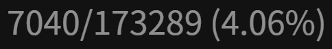

## ッツ Ebook Reader

An online e-book reader that supports Yomichan, which is hosted on [https://reader.ttsu.app](https://reader.ttsu.app)

# Features

- [x] Supports HTMLZ and EPUB files
- [x] Customizable environment (e. g. themes, font size, image blur, furigana settings etc.)
- [x] Continuous / Pagination reader mode
- [x] Vertical / Horizontal reading mode
- [x] Character count and progress display
- [x] Table of content support for EPUB files
- [x] (Auto) bookmark functionality
- [x] Auto scroll (continuous mode)
- [x] Book manager
- [x] Installation and offline capabilities

# Usage

The first time you enter the page (or have no files loaded yet) you will need to select the books you want to read from your device.
You can load files by clicking/tapping on the dropzone or respective Icons.
Alternatively, you can also drag & drop files or folders on the manager if your device supports it.

You can find most of the reader controls in the reader header which you can open by clicking/tapping in the upper area of the page:

| Control                                          | Description                                                                     |
| ------------------------------------------------ | ------------------------------------------------------------------------------- |
|            | Opens the table of content if available                                         |
|       | Allows you to create a bookmark at your current location (keybind <kbd>b</kbd>) |
|            | Displays current auto scroll speed (keybind <kbd>a</kbd>/<kbd>d</kbd>)          |
|     | Allows you to enter fullscreen mode (keybind <kbd>F11</kbd>)                    |
|       | Navigates you to the settings                                                   |
|        | Navigates you to the book manager                                               |
|  | Displayed at the current bookmark location                                      |
|         | Displays your reading progress, click/tap on it to hide                         |

# Desktop Keybinds

**Note:** The keys are currently bound to their physical location.  
Explanation from [MDN](https://developer.mozilla.org/en-US/docs/Web/API/KeyboardEvent/code):

> For example, the code returned is "KeyQ" for the Q key on a QWERTY layout keyboard, but the same code value also
> represents the ' key on Dvorak keyboards and the A key on AZERTY keyboards.

| Key Code            | Description                              |
| ------------------- | ---------------------------------------- |
| <kbd>Space</kbd>    | Toggle auto-scroll (continuous mode)     |
| <kbd>a</kbd>        | Increase auto-scroll speed               |
| <kbd>d</kbd>        | Decrease auto-scroll speed               |
| <kbd>b</kbd>        | Create bookmark at your current location |
| <kbd>r</kbd>        | Return to bookmark location              |
| <kbd>PageDown</kbd> | Move to next page                        |
| <kbd>PageUp</kbd>   | Move to previous page                    |
| <kbd>n</kbd>        | Move to next/previous chapter            |
| <kbd>m</kbd>        | Move to next/previous chapter            |

# Book Manager

You can open the book manager by clicking/tapping on the respective icon in the reader.
You will be presented with a list of covers for all the imported books with their respective titles and progress (determined
by bookmark location).

You may:

- Switch books by clicking/tapping on the book covers
- Delete books by clicking/tapping on the delete icon (**Warning:** Bookmark progress will also get removed along with the book)
- Click/tap on the centered list icon to select all books
- Click/tap on the X icon to deselect all books

You may find the following controls in the manager:

| Control                                          | Description                                                                |
| ------------------------------------------------ | -------------------------------------------------------------------------- |
|     | Toggles book selection                                                     |
|  | Selects all books                                                          |
|    | Allows you to import new books to the library                              |
|  | Allows you to import new books from a folder to the library (desktop only) |
|       | Navigates you to the settings                                              |
|            | Allows you to download data for a bug report                               |

# Self Host

If for some reason you want to host the reader by yourself, you can use the following approach.

### Using Docker

1. Install and launch [Docker](https://docs.docker.com/get-docker/)
2. Run the commands below

```sh
docker build -t ebook-reader -f apps/web/Dockerfile .
docker run --name ebook-reader -d -p 8080:80 ebook-reader
```

3. Visit [http://localhost:8080](http://localhost:8080) to use the app

### Using Docker Compose

1. Install and launch [Docker Compose](https://docs.docker.com/compose/install/)
2. Run the command below

```sh
docker-compose up
```

3. Visit [http://localhost:8080](http://localhost:8080) to use the app

### Using HTTP Hosting App

1. Have [Node.js](https://nodejs.org/) and [pnpm](https://pnpm.io/installation) installed
2. Run the commands below

```sh
cd apps/web
pnpm install --frozen-lockfile
pnpm build
```

3. Have your server (such as [http-server](https://www.npmjs.com/package/http-server)) point towards `apps/web/build`
